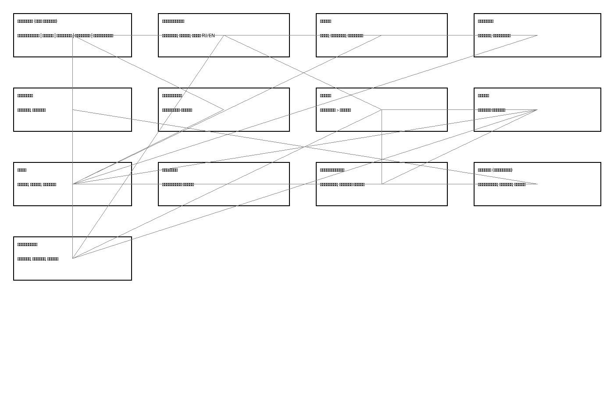
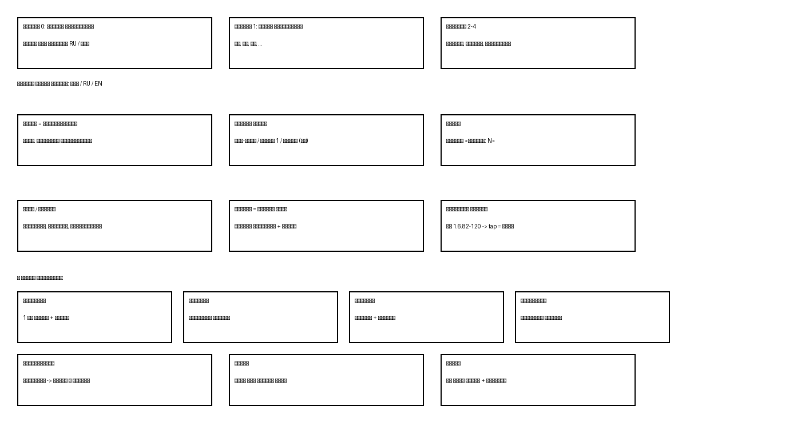

# Руководство пользователя «Гухьятама»

Приложение «Гухьятама» — это домашняя библиотека книг и лекций на телефоне.
Всё хранится прямо в телефоне, интернет для чтения не нужен.

> Как сделаны картинки в этом руководстве: запустить приложение на компьютере
> не удалось (нет ни телефона с кабелем, ни эмулятора), поэтому вместо
> фотографий экрана — точные схемы по исходному коду. Каждый подписанный
> элемент проверен в коде. То, что не удалось увидеть глазами, помечено
> значком [S].

## Содержание

1. [Что это за приложение](#1-что-это-за-приложение-и-для-чего-оно-нужно)
2. [Установка и запуск](#2-как-установить-приложение-и-запустить-его)
3. [Первый запуск](#3-первый-запуск-что-пользователь-увидит-на-экране)
4. [Главный экран](#4-обзор-главного-экрана)
5. [Навигация](#5-подробное-описание-навигации)
6. [Как устроена библиотека](#6-как-устроена-библиотека)
7. [С чего начать и куда нажимать](#7-с-чего-начать-и-куда-нажимать)
8. [Поиск](#8-поиск-и-работа-с-результатами-поиска)
9. [Чтение](#9-чтение-материалов-и-дополнительные-возможности-просмотра)
10. [Аудио](#10-аудио-и-прослушивание)
11. [Сохранённое](#11-избранное-закладки-заметки-вопросы)
12. [Настройки](#12-настройки-приложения)
13. [Затруднения](#13-типичные-затруднения-и-способы-их-решения)
14. [Как не потеряться](#14-как-вернуться-на-предыдущий-экран-и-что-делать-если-потерялся)
15. [Памятка](#15-краткая-памятка)

---

## 1. Что это за приложение и для чего оно нужно

«Гухьятама» — электронная библиотека. В ней живут книги (например,
«Бхагавад-гита», «Шримад-Бхагаватам», «Чайтанья Чаритамрита», письма),
а также записи лекций с их текстами. Внутри книг можно искать слова,
читать переводы и комментарии, сохранять понравившиеся места, делать
заметки и задавать вопросы к стихам, слушать озвучку.

Слово «стих» в приложении означает одну единицу текста: это может быть
настоящий стих из книги или одна лекция целиком. Слово «книга» означает
одно произведение целиком (например, вся «Бхагавад-гита» — это одна книга).

## 2. Как установить приложение и запустить его

1. Получите установочный файл приложения (файл с окончанием `.apk`)
   от человека, который вам его даёт.
2. Откройте этот файл на телефоне. Телефон спросит разрешение на установку —
   разрешите.
3. На экране телефона появится значок «Гухьятама». Нажмите на него один раз.
   Приложение откроется.

Для работы нужен телефон с Android версии 6.0 или новее. Интернет не нужен.

## 3. Первый запуск: что пользователь увидит на экране

При первом запуске библиотека пуста: книг ещё нет, поэтому список пуст
и разделы не показываются. Это нормально — книги добавляются отдельно
(раздел 12, «Импорт книг»).

Внизу экрана всегда видна панель из пяти картинок-кнопок (слева направо):
книги 📚, лупа 🔍, блокнот 📓, вопрос ❓, звезда ⭐. Подписей под ними нет —
запомните порядок. Эта панель не пропадает ни на одном экране.

## 4. Обзор главного экрана

Главный экран — это вкладка 📚 «Библиотека».

- **Верхняя строка.** Слева — кнопка языка. На ней написано «Все», «RU»
  или «EN». Каждое нажатие переключает по кругу: все книги → только русские →
  только английские → снова все. По центру — название «Гухьятама». Справа —
  значок настроек «⚙️», открывает экран настроек.
- **Разделы.** Ниже идут заголовки разделов. Раздел — это полка, на которой
  лежат похожие книги. Всего полок пять:
  1. «Лекции Шьямакунды Прабху»,
  2. «Основные книги и лекции Шрилы Прабхупады»,
  3. «Письма и беседы Шрилы Прабхупады»,
  4. «Книги Ачарий»,
  5. «Остальное».
  
  Пустые полки не показываются. Нажатие на название полки сворачивает её
  (остаётся строка с числом книг, например «▸ 4») или разворачивает обратно («▾»).
- **Карточки книг.** Книги лежат сеткой по две в ряд. На карточке: картинка
  обложки (или квадрат с первой буквой названия), под ней название
  и строка «~N мин» — примерное время чтения всей книги. Если вместо времени
  написано «⏳ Импорт идёт…» — книга ещё загружается, открыть её пока нельзя,
  подождите. Жёлтая звезда ★ в углу карточки означает, что в книге стоит
  закладка; нажатие на звезду ведёт сразу к saved месту.
- **Долгое нажатие на карточку** (нажать и подержать палец) открывает меню:
  «Открыть», «В начало раздела», «В конец раздела», «▲ Выше», «▼ Ниже»
  (перестановка карточек), «🗑 Удалить» (красным — удаление с вопросом
  подтверждения). Карточку можно также тащить пальцем после долгого нажатия,
  чтобы переставить.

## 5. Подробное описание навигации

*Схема переходов: стрелка означает «отсюда можно попасть туда нажатием» [S].*

- Нижние пять кнопок всегда на месте и ведут: 📚 на полки, 🔍 в поиск,
  📓 в заметки, ❓ в вопросы, ⭐ в избранное.
- Внутрь книги уходят так: полка → книга → раздел книги (например, песнь) →
  глава → стих. Каждый шаг — нажатием на плитку или строку.
- Кнопка «назад» на телефоне возвращает на один шаг назад, в обратном порядке.
- Отдельный путь назад есть внутри книги: вторая строка в шапке (название
  книги под названием раздела) — это кнопка возврата к списку разделов.
- Из любого экрана стиха кнопка «назад» возвращает туда, откуда пришли
  (список главы, поиск, заметка, словарь).

## 6. Как устроена библиотека

*Схема: что во что вложено [S].*

- **Раздел приложения** (полка, 5 штук, см. раздел 4) — самый верхний уровень.
- **Книга** — одно произведение целиком. У книги есть язык: русская или
  английская. Фильтр языка вверху главного экрана прячет чужие книги.
- **Раздел книги** — крупная часть произведения. У «Шримад-Бхагаватам» это
  песни («Песнь 1 «Творение»»), у «Чайтанья Чаритамриты» — лилы
  («Ади-лила», «Мадхья-лила», «Антья-лила»), у писем — годы, у «Бхагавад-гиты»
  разделов нет: там сразу главы. Если раздел один, его плитка не показывается.
- **Глава** — часть раздела. На плитке главы написано число стихов
  («Стихов: N»). Главы без стихов не показываются.
- **Стих** — единица чтения. У стиха книги бывает до пяти частей:
  санскрит (подлинник), транслитерация (звучание русскими/латинскими буквами),
  пословный перевод (каждое слово отдельно), литературный перевод, комментарий.
  Какие части показывать — выбирается в настройках.
- **Лекция** — устроена как особый стих: вместо пяти частей у неё название
  («Лекция №29 по стихам 134-149 — Сварупа Кришны»), мелкая подпись-номер
  («ЧЧ 2.8.134») и полный текст. Первая в книге лекция называется «Введение»
  и стоит первой. Номера стихов прямо в тексте лекции — ссылки: нажатие
  открывает стих, кнопка «назад» возвращает обратно в лекцию.
- К стиху могут быть привязаны: **закладка** (одно место на книгу, звезда),
  **заметки** (ваши выписки), **вопросы** (ваши вопросы с цитатой),
  **карточки избранного**, **картинки** (строка «Иллюстрации (N)» ведёт
  к ним), **звук** (запись или озвучка телефоном).

## 7. С чего начать и куда нажимать

Новичку после установки достаточно трёх задач. Выполните их по порядку.

**Задача 1. Положить книги в приложение.**
Книги сами не появятся. Откройте ⚙️ (верхний правый угол главного экрана),
найдите раздел «Импорт книг» и нажмите одну из кнопок: «TXT», «PDF», «DOCX»
(ваш файл с текстом; скан без текстового слоя превратится в книгу с пометкой,
что нужен OCR) или «.db» / «📁 Папка с .db» (готовые файлы библиотеки
от того, кто дал вам приложение). Дождитесь строки «Готово». Вернитесь назад —
книги лежат на полках. Подробности — в разделе 12.

**Задача 2. Открыть и почитать.**
Нажмите 📚. Нажмите на карточку книги. Если показались плитки разделов
(песни, лилы) — нажмите нужный. Нажмите плитку главы. Нажмите строку стиха.
Читайте. Кнопки «← Пред» / «След →» внизу и листание пальцем влево-вправо
переходят к соседним стихам, даже через границу глав.

**Задача 3. Найти слово.**
Нажмите 🔍. В поле «Поиск по всем книгам» введите слово (от 2 букв).
Нажмите строку выдачи — откроется стих ровно на месте совпадения.
Подробности — в разделе 8.

## 8. Поиск и работа с результатами поиска

Что можно искать: любое слово из текстов, переводов, комментариев и пословника;
поиск понимает слова с чёрточками (диакритику можно не набирать: «praptam»
найдёт «prāptam»). Номер стиха напрямую не ищется — стих находят через книгу
и главу (раздел 7, задача 2).

1. Нажмите 🔍 внизу экрана.
2. Нажмите на поле «Поиск по всем книгам» и введите слово. Поиск начинается
   сам при вводе, ждать и нажимать «Найти» не нужно.
3. При желании сузьте поиск: ряд «Везде / Санскрит / Стих / Коммент.»
   (где искать) и ряд «Все языки / RU / EN» (в каких книгах).
4. Под полем копятся прошлые запросы («История»); нажатие на старый запрос
   повторяет поиск, «Очистить» стирает историю.
5. Каждая строка выдачи: «Книга · номер» и отрывок, совпадение подсвечено
   зелёным. Нажмите строку — откроется стих, промотанный к совпадению.

**Словарь.** В пословнике стиха каждое слово нажимается: открывается экран
слова (««слово» — N»): строки «слово жирным + перевод курсивом + ссылка».
Переключатель «Все языки» показывает вхождения и в книгах другого языка
(по умолчанию — только язык той книги, откуда нажали). Тап по строке ведёт
к стиху. Слово ищется сразу в русской и латинской записи.

## 9. Чтение материалов и дополнительные возможности просмотра

- **Внутри главы** список идёт подряд; позиция запоминается: после поворота
  экрана и после возврата со стиха вы окажетесь там же, где были.
- **Свайп в конце списка главы** влево открывает следующую главу, вправо
  в начале — предыдущую (пустые главы пропускаются).
- **Внутри стиха** пять блоков (см. раздел 6); лишние отключаются в настройках.
- **Долгое нажатие на строку в главе**: «Скопировать» (текст с номером —
  в буфер обмена), «В избранное» (карточка; повторы не плодятся).
- **Выделение пальцем в тексте стиха**: появившееся меню даёт «В заметку»
  (фрагмент сохраняется), «Вопрос» (открывается редактор вопроса с цитатой),
  «Скопировать», последним — «Перевести» (открывает выбор переводчика).
- **Цитаты вида «БГ 2.13», «ШБ 1.2.3»** в тексте — ссылки: тап открывает стих.
  Под текстом бывают блоки «Где встречается этот стих» (ссылки отсюда),
  «Где цитировался данный стих» (кто ссылается сюда) и «Похожие в главе».
- **Кнопка «RU»/«EN»** в шапке стиха открывает тот же стих на другом языке
  (если он загружен). Кнопка «🎲» в шапке книги открывает случайный стих.
- **Кнопки громкости телефона**, пока открыт экран чтения, меняют размер
  шрифта: на экране стиха — шрифт стиха, на списках — шрифт списков.
- Если вместо стиха открылось «Стих не найден» — книга удалена или
  импортирована заново под другим именем; откройте её с полки заново.

## 10. Аудио и прослушивание

Строка звука есть на экране стиха, только если стих можно озвучить.
Кнопка «▶ Слушать» играет запись; «▶ Слушать (TTS)» — читает телефонным
голосом (санскрит); «■ Стоп» останавливает. Если голоса нет, приложение
покажет окно «Нет синтеза речи» / «Нет голоса» с кнопками «Установить» /
«Настройки речи» — следуйте им. Отдельного плеера и фоновых уведомлений
в приложении нет. Связь простая: звук принадлежит стиху и запускается
с его экрана.

## 11. Избранное, закладки, заметки, вопросы

- **Закладка** — одно место на книгу. Ставится звездой: ☆/★ в шапке главы
  запоминает место в списке, в шапке стиха — сам стих. Звезда на карточке
  книги ведёт к закладке. Повторное нажатие на горящую звезду снимает закладку.
- **Избранное** (⭐): карточки «подпись стиха + начало текста». Создаются
  долгим нажатием «В избранное» в главе. Тап открывает стих; если стих удалён
  вместе с книгой — строка не нажимается. «×» удаляет карточку.
- **Заметки** (📓): фрагменты, сохранённые пунктом «В заметку» при выделении.
  Видно подпись стиха и дату. Тап открывает стих, «×» удаляет.
- **Вопросы** (❓): нумерованный список «N. БГ 2.13 — тема». Создаются пунктом
  «Вопрос» при выделении. Тап — правка (поля «О чём вопрос» и «Текст вопроса»
  обязательны, кнопка «Сохранить» серая, пока пусты), «›» — к стиху,
  «×» — удаление.
- Всё это хранится в телефоне. Копия делается в настройках: раздел
  «Заметки и бэкап», кнопки «Экспорт» / «Импорт» (файл `vedalibrary-notes.json`).
  Раз в неделю приложение само кладёт копию в свою папку.
- **Удаление книги** (меню плитки «🗑 Удалить» или корзина в настройках)
  стирает книгу целиком: стихи, закладку и связанные заметки. Окно спрашивает
  подтверждение («Удалить» красным / «Отмена»). Это необратимо — сначала
  сделайте экспорт из предыдущего пункта.

## 12. Настройки приложения

Значок «⚙️» — вверху главного экрана, книги, главы и стиха. Внутри, сверху вниз:

1. **Импорт книг.** Строка «Сборка приложения» — дата установки программы
   (нужна, чтобы свериться, свежий ли у вас вариант). Строка состояния
   показывает ход («Импорт: …») или ошибку («Ошибка: …»), крестик «×»
   прячет сообщение. Кнопки: «TXT» (ваш текстовый файл), «PDF» (документ;
   скан без текстового слоя не прочитается — попросит OCR), «DOCX»
   (файл Word), «.db» (один файл библиотеки), «📁 Папка с .db» (сразу много).
   Карточка с «⏳ Импорт идёт…» на полке означает незавершённую загрузку.
2. **Разделы стиха.** Пять выключателей: санскрит, транслитерация, пословный
   перевод, перевод, комментарий. Выключенное пропадает с экрана стиха.
3. **Шрифты.** Два ползунка (12–30): «Шрифт стиха» и «Шрифт списка главы».
   Двигайте, цифра показывает размер.
4. **Выравнивание текста.** «Влево» / «По ширине» / «По центру» — для
   переводов, комментариев и списков.
5. **Книги по разделам.** Список всех книг: видно, на какой полке лежит
   каждая. Нажатие (или «▾») открывает выбор из пяти полок. Корзина «🗑» —
   удаление книги с подтверждением.
6. **Заметки и бэкап.** «Экспорт» сохраняет файл, «Импорт» загружает его
   обратно. Телефон сам делает копию раз в неделю.

## 13. Типичные затруднения и способы их решения

- **Полки пустые.** Книги не встроены — добавьте их через ⚙️ → «Импорт книг».
- **Карточка не открывается, «Импорт идёт…».** Дождитесь конца загрузки.
- **Открылся «Стих не найден».** Книга удалена или заменена. Откройте книгу
  с полки заново.
- **«(стих недоступен)» в заметках.** Стих удалён вместе с книгой.
  Удалите запись крестиком. В избранном такая строка просто не нажимается.
- **Поиск ничего не находит.** Проверьте: минимум 2 буквы; фильтры области
  («Везде» — самый широкий) и языка («Все языки» — самый широкий).
- **Нет звука / нет голоса.** Следуйте окну: «Установить» или «Настройки речи»,
  скачайте голос (для санскрита подойдёт хинди).
- **Импорт пишет «Ошибка».** Прочитайте текст ошибки в строке состояния:
  оборванный файл («скопировался не полностью») — перекиньте заново;
  «это не SQLite-база» — выбран не тот файл (журнальные `-journal` не подходят).
- **Потерялась книга после переустановки.** Книги живут только в телефоне.
  Держите экспорт заметок (раздел 11) и файлы `.db` для повторного импорта.

## 14. Как вернуться на предыдущий экран и что делать, если потерялся

- Кнопка «назад» на телефоне всегда возвращает на один шаг: стих → список →
  глава → разделы → полки.
- Нижние пять кнопок всегда на месте: заблудились — нажмите 📚 и начните
  с полок заново.
- Внутри книги вторая строка шапки (название книги) — это кнопка назад
  к разделам.
- Со стиха «назад» возвращает туда, откуда пришли: в главу, в поиск,
  в заметку или в словарь.

## 15. Краткая памятка

- Книги добавляются: ⚙️ → «Импорт книг» → кнопка файла → «Готово».
- Читать: 📚 → книга → раздел → глава → стих.
- Искать: 🔍 → слово (от 2 букв) → строка выдачи.
- Сохранить место: звезда ☆/★. Сохранить кусок: выделить → «В заметку».
- Спросить: выделить → «Вопрос» → заполнить два поля → «Сохранить».
- Шрифт: ползунки в ⚙️ или кнопки громкости на экране чтения.
- Потерялся: кнопка «назад» или 📚.
